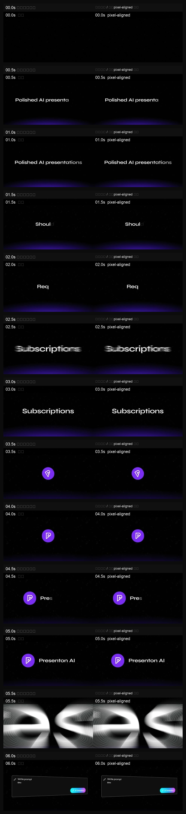

# Reference Video Replica QC

用于参考视频复刻、拆解和对齐质检。它不是“凭感觉复刻”，而是先抽帧、写时间线，再用候选视频做对照验证。

## 示例成片：Presenton 复刻 Bitexact 成片

[▶ Watch Presenton Replica Bitexact Showcase](https://github.com/user-attachments/assets/f792bd12-d8b3-43b7-b751-98aeb033713b)

- 类型：参考视频复刻结果
- 级别：bit-exact / pixel-aligned 交付成片
- 时长：35.136 秒
- 规格：1920x1080，30fps，H.264 + AAC
- 文件：`reference-video-replica-qc/assets/showcases/presenton-replica-pixel-aligned-bitexact.mp4`

0.5 秒对照抽帧：



## 做什么类型的视频

- 参考视频复刻
- 像素级/视觉级/风格级对齐判断
- HyperFrames / Remotion 重制视频的质检
- “当前仍然没有对齐”这类返修定位

## 风格与方法

这是一个质检和拆解 skill，本身不固定某种视觉风格。它关注证据：

- 每 `0.5s` 抽帧
- 秒级行为时间线
- side-by-side contact sheet
- PSNR / SSIM / 哈希 / `cmp` 等硬指标
- 第一个失败时间点和修复清单

## 适合使用

- "复刻这个视频。"
- "每 0.5 秒抽帧分析原视频。"
- "检查新视频和参考视频是否对齐。"
- "我要像素级对齐。"

## 不适合使用

- 只想做一个同风格原创短片。那更适合 `dark-saas-magic-video`。
- 只想做黑底白字开场。那更适合 `black-white-text-opener`。

## 安装

```bash
npx skills add https://github.com/Pluviobyte/video-production-skills --skill reference-video-replica-qc
```
